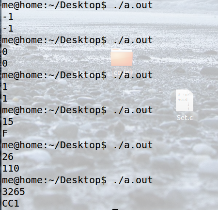

1、阅读 PseudocodeStandard。（答案可以打印） 
1）用伪代码描述将十进制转换成16进制的方法 

    FUNCTION(NUM)
    A=NUM%16
    IF NUM>=16 THEN
    NUM/=16
    FUNCTION(NUM)
    ENDIF
    CASE A OF
    10:PRINT 'A'
    11:PRINT 'B'
    12:PRINT 'C'
    13:PRINT 'D'
    14:PRINT 'E'
    15:PRINT 'F'
    DEFAULT PRINT A
    ENDCASE

2）C语言实现（先用注释写好算法，然后翻译）
    
    # include <stdio.h>
    int function(int num)
    {
	int tem;
	tem=num%16;
	if(num>=16)
	{	
		num/=16;
		function(num);
	}
	switch(num)
	{
		case 10:printf("A");break;
		case 11:printf("B");break;
		case 12:printf("C");break;
		case 13:printf("D");break;
		case 14:printf("E");break;
		case 15:printf("F");break;
		default:printf("%d",tem);
	}
    }   

    int main(){
	int num;
	scanf("%d",&num);

		function(num);
        printf("\n");

    }

 3）使用 -1,  0,  1,  15,   26，3265 最为输入测试你的程序

2、名词解释与对比 

1）Top-down design

A top-down approach is essentially the breaking down of a system to gain insight into its compositional sub-systems in a reverse engineering fashion. 
自上而下本质上是以逆向工程的方式分解系统以深入了解其组成子系统的方法。
 2） Work breakdown structure (WBS) 

 A work-breakdown structure (WBS) in project management and systems engineering, is a deliverable-oriented breakdown of a project into smaller components. 

在项目管理和系统工程中，工作分解结构（WBS）是面向交付的项目分解为更小的组件。

 3）简述管理学WBS 与 信息学Top-down设计 的异同

 同：都是分解系统来组成子系统

异：Top-down由上到下，WBS根据不同类别分成小的部分

3、仔细观察您洗衣机的运作过程，运用Top-down设计方法和Pseudocode 描述洗衣机控制程序。

假设洗衣机可执行的基本操作如下： 

water_in_switch(open_close)  // open 打开上水开关，close关闭

 water_out_switch(open_close)  // open 打开排水开关，close关闭 
 
 get_water_volume()  //返回洗衣机内部水的高度

motor_run(direction) // 电机转动。left左转，right右转，stop停

 time_counter()  // 返回当前时间计数，以秒为单位 halt
 
 (returncode) //停机，success 成功 failure 失败

1）请使用伪代码分解“正常洗衣”程序的大步骤。包括注水、浸泡等 

1. 选择洗衣模式——对应水位，浸泡时间，洗涤时间,脱水时间

2. 注水——水位计计水位 

3. 浸泡——计时器计时 

4. 电机转动——左3次，右3次 

5. 排水—— 水位计计水位 

6. 电机转动——脱水

7. 结束

2）进一步用基本操作、控制语句（IF、FOR、WHILE等）、变量与表达式，写出每个步骤的伪代码

    1.  READ 洗衣模式；
    2. water_in_switch(open)；
        IF get_water_volume() >= 对应水位 THEN
        water_in_switch(close)
        ENDIF
    3. REPEAT 浸泡 UNTIL time_counter()==浸泡时间 
    4. IF time_counter()<洗涤时间 THEN
        motor_run(left) three times
        motor_run(right)three times
        ENDIF
    5。water_out_switch（open）
        IF  get_water_volume() ==0 THEN
        water_out_switch(close)
        ENDIF
    6.  REPEAT
        motor_run(left) 
        UNTIL
        time_counter()==脱水时间
    7.returncode

3）根据你的实践，请分析“正常洗衣”与“快速洗衣”在用户目标和程序上的异同。 你认为是否存在改进（创新）空间，简单说明你的改进意见？ 
1. 快速洗衣没有浸泡过程
2. 增加洗涤的力度选择，以更好的进行洗涤和脱水。
4）通过步骤3），提取一些共性功能模块（函数），简化“正常洗衣”程序，使程序 变得更利于人类理解和修改维护。例如： wait(time) //等待指定的时间； 注水(volume,timeout) //在指定时间内完成注水，否则停机； 排水(timeout)。等子程序
1. 浸泡（timeout）
2. 洗涤（timeout，direction）
3. 脱水（timeout，direction）