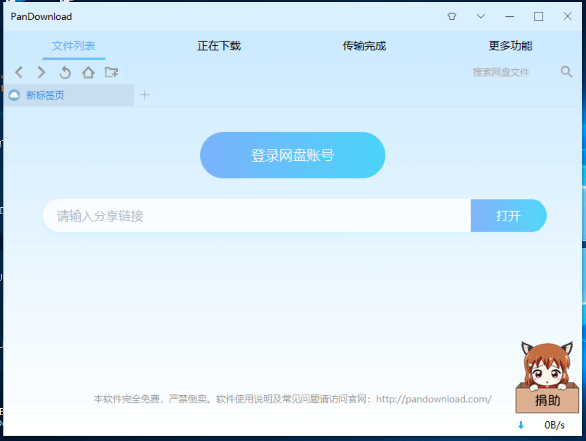

# 百度网盘如何解决限速(干货)

&emsp;&emsp;百度网盘是大家公认的观影神器（自某播之后）。可是当我们费尽力气找到一部心仪的电影之后，百度网盘的下载速度堪比“龟速”。但当我们开通超级会员则是另一片天地~~因此本篇主要解决百度网盘的限速问题。(只作为分享，不用于任何商业范围)

* PanDownload(本人在用)

一个可以直接满速下载的c++程序~~对于不会使用插件的小白非常方便

* 双霖度盘下载器

本下载器相对于上一个来说速度更快，可自动选择线路。由原作者双霖等人开发，2.0版界面全新设计。

* 速盘

由吾爱破解论坛会员“菩提叶”制作的度盘满速下载工具。支持链接下载，支持离线下载，功能十分强大。

以上就是我推荐的三个破解网盘限速的软件。

下载地址：

链接：https://pan.baidu.com/s/13_2db8FjFvxCj_2BafeWLw 

提取码：h0xf

