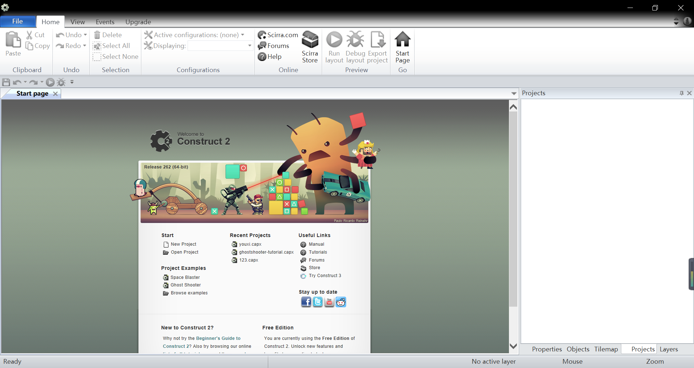
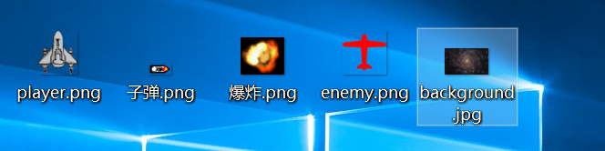
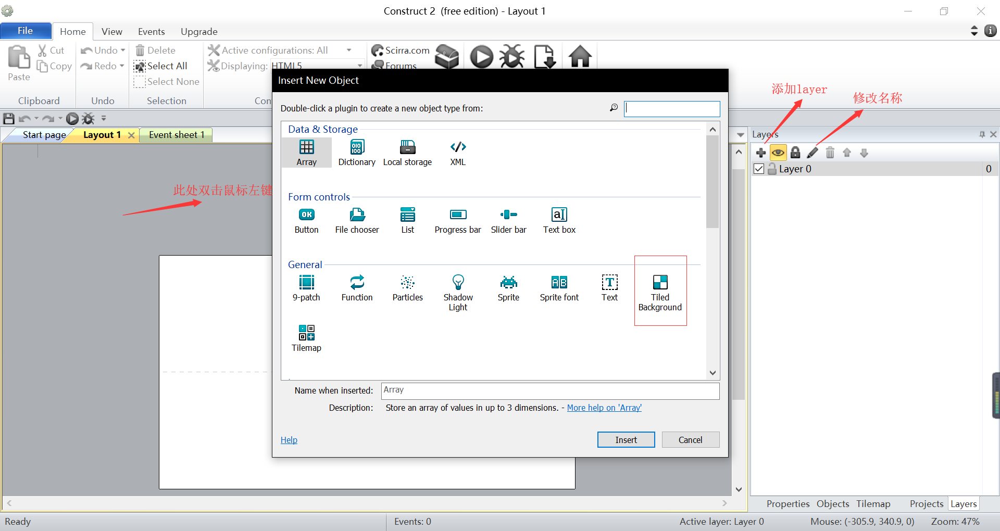
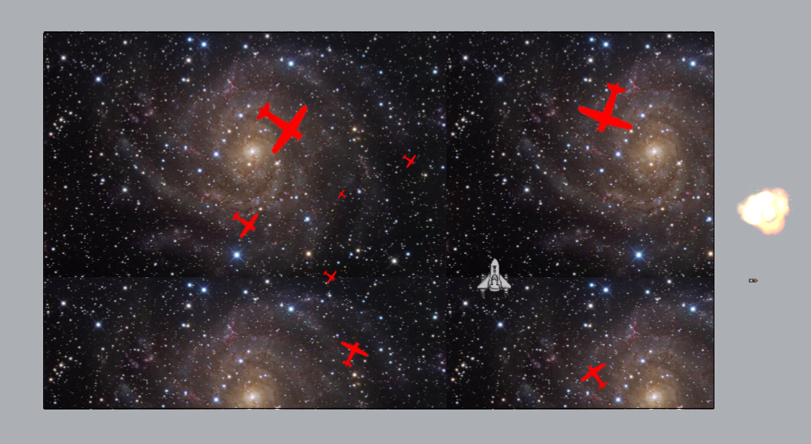
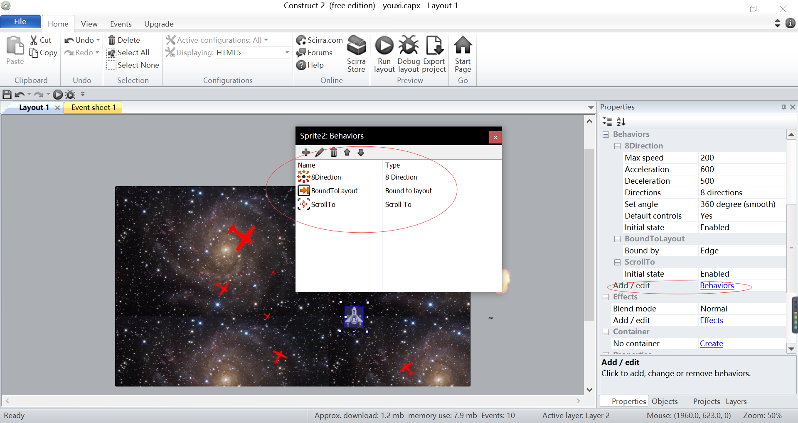
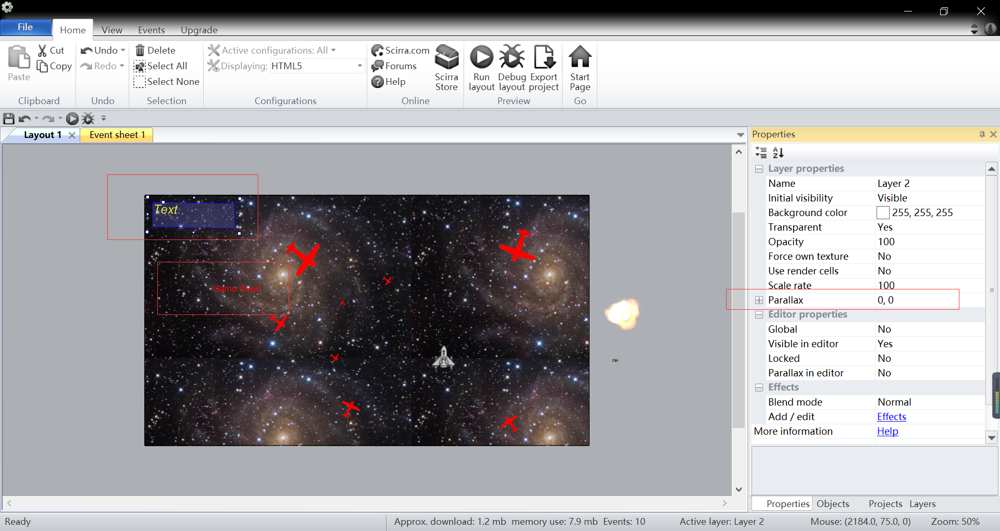
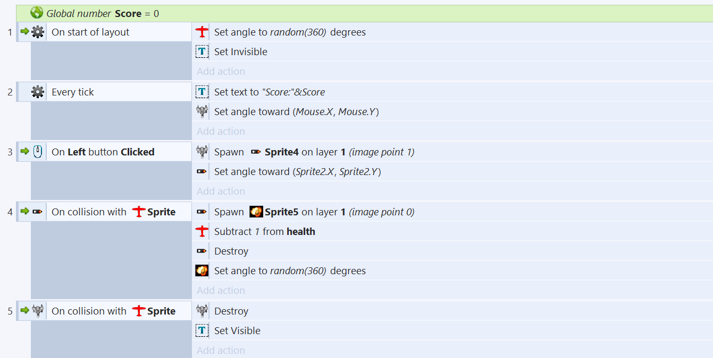
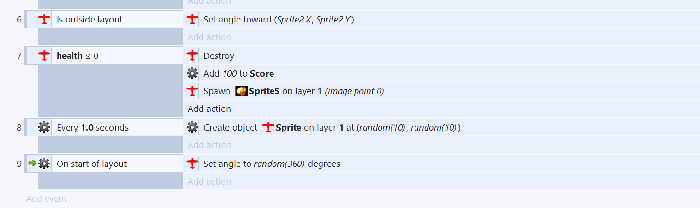
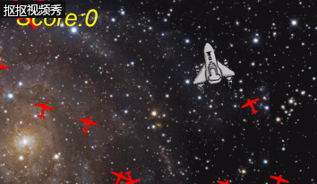

# 用Construct 2制作游戏（入门篇）

&emsp;&emsp;Construct 2是一个游戏编辑软件。我经过长达五个小时的研究摸索，终于用它做出了一款很粗糙的游戏————飞机大战。下面我就来回顾一下我的辛酸历程
* 安装

我们可以进入其官网（https://www.scirra.com/construct2 ）
进行安装，这里不加陈述。

* HELLO Construct 2

打开程序就是这样子的，作为一名大一新生，全英文的操作界面还是有些不太习惯，因此我花费了一些时间来学习HELP中基本的操作。（英语基础较好的人请忽略）

* 准备

做一个游戏首先我们要先准备好素材，今天我们要做的是一款飞行射击游戏，所以我们要准备的是背景，飞机，子弹，爆炸这四样素材。（建议用搜索软件寻找自己喜爱的素材）

* 过程
1. 首先我们要创建一个新项目（New Empty Project），开始我们的创作。
2. 添加一个layer用于存放背景，为了不至于搞混，我们将其命名为background。然后在灰色空白处双击，点击Tiled background添加背景（注意要选择background层）

3. 加入素材。再另一个layer中双击灰色区域，点击Sprite加入素材.（按住ctrl拖动飞机可以创造多个相同飞机）

4. 进行behaviors创建。选择player素材,在properties中add behaviors.(如图添加以下behaviors)

同时，我们要对子弹设置Destroy Outside Layout,对爆炸设置Fade，并将其Blend Mode改为Additive（这样爆炸效果不会有黑色阴影）
5. 添加TEXT。新建一个layer，用其来加入用于显示分数和gameover的对话框。如图设置。选中相应TEXT可以调节成自己喜欢的字体、字号和颜色。

6. 下面就是一些高级设置（代码），具体作用help中已经有详细介绍。具体如下图。

* 测试并保存
至此，所有的代码已经编写完毕，排除bug后，我们就可以畅玩我们自己做出来的游戏了。

* 总结
用construct 2写游戏特别适合像我一样热爱游戏但又知识储备有限的人。它的操作不是特别繁琐，代码理解起来也不是特别困难。其官网上也有大量教程。最后，愿大家都能利用本软件写出自己心仪的游戏。