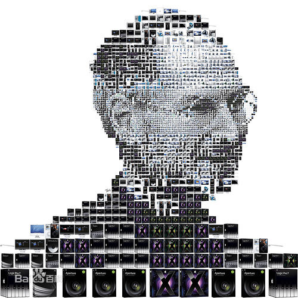
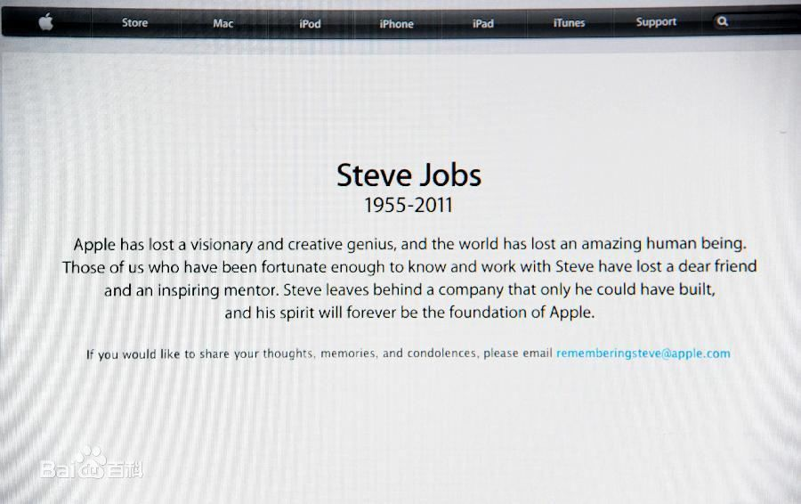
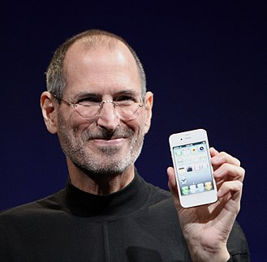

# 史蒂夫·乔布斯———一个时代的缔造者
&emsp;&emsp;史蒂夫·乔布斯（Steve Jobs，1955年2月24日—2011年10月5日），出生于美国加利福尼亚州旧金山，美国发明家、企业家、美国苹果公司联合创办人。

&emsp;&emsp;乔布斯被认为是计算机业界与娱乐业界的标志性人物，他经历了苹果公司几十年的起落与兴衰，先后领导和推出了麦金塔计算机（Macintosh）、iMac、iPod、iPhone、iPad等风靡全球的电子产品，深刻地改变了现代通讯、娱乐、生活方式。乔布斯同时也是前Pixar动画公司的董事长及行政总裁。

## 乔布斯的传奇人生

### 早年经历
1955年2月24日，史蒂夫·乔布斯出生在美国旧金山。刚刚出世就被父母遗弃了。幸运的是，保罗·乔布斯和克拉拉·乔布斯——一对好心的夫妻领养了他。

乔布斯生活在美国“硅谷“附近，邻居都是惠普公司的职员。在这些人的影响下，乔布斯从小迷恋电子学。一个惠普的工程师看他如此痴迷，就推荐他参加惠普公司的“发现者俱乐部“，这是个专门为年轻工程师举办的聚会，每星期二晚上在公司的餐厅中举行。在一次聚会中，乔布斯第一次见到了电脑，他开始对计算机有了一个朦胧的认识。  
上初中时，乔布斯在一次同学聚会上与斯蒂夫·沃兹尼亚克见面，两人一见如故。斯蒂夫·沃兹尼亚克是学校电子俱乐部的会长，对电子有很大的兴趣。

19岁那年，乔布斯只念了一学期就因为经济因素而休学，成为雅达利电视游戏机公司的一名职员。借住沃兹家的车库，常到社区大学旁听书法课等课程。1974年8月南亚次大陆最炎热的时节，他来到了印度朝圣。

乔布斯一边上班，一边常常与沃兹尼亚克一道，在自家的小车库里琢磨电脑。他们梦想能够拥有一台自己的计算机，可是当时市面上卖的都是商用的，且体积庞大，极其昂贵，于是他们准备自己开发。1976年在旧金山威斯康星计算机产品展销会上买到了6502芯片，带着6502芯片，两个年轻人在乔布斯家的车库里装好了第一台电脑。

乔布斯为筹集批量生产的资金，卖掉了自己的大众牌小汽车，同时沃兹也卖掉了他的惠普65型计算器。就这样，他们有了1300美元。

1976年4月1日，乔布斯、沃兹及乔布斯的朋友龙·韦恩签署了一份合同，决定成立一家电脑公司。随后，21岁的乔布斯与26岁的斯蒂夫·沃兹尼亚克在自家的车房里成立了苹果公司。公司的名称由乔布斯定为苹果。而他们的自制电脑则被追认为“苹果Ⅰ号“电脑了。  
### 早期发展
苹果公司成立初期，“苹果“机的生意清淡。1976年7月，一个偶然的机遇给“苹果“公司带来了转机。零售商保罗·特雷尔（Paul Jay Terrell）来到了乔布斯的车库，当看完乔布斯演示完电脑后，决定订购50台整机，这是做成的第一笔生意。
 
之后“苹果“公司开始了小批量生产。1976年10月，马尔库拉前来拜访沃兹和他们的车库工场。马尔库拉是位电气工程师，擅长推销工作，他主动帮助他们制定一份商业计划，给他们贷款69万美元，有了这笔资金，“苹果“公司的发展速度大大加快了。
1977年4月，乔布斯在美国第一次计算机展览会展示了苹果Ⅱ号样机。

1980年12月12日，苹果公司股票公开上市，在不到一个小时内，460万股全被抢购一空，当日以每股29美元收市。按这个收盘价计算，苹果公司高层产生了4名亿万富翁和40名以上的百万富翁。乔布斯作为公司创办人排名第一。 

1983年，Lisa数据库和Apple Iie发布，售价分别为9998美元和1395美元。但是Lisa的昂贵的售价是没有多少市场的，而Lisa又侵吞了Apple大量研发经费。
由于乔布斯经营理念与当时大多数管理人员不同，加上IBM公司推出个人电脑，抢占大片市场，总经理和董事们便把这一失败归罪于董事长乔布斯，于1985年4月经由董事会决议撤销了他的经营大权。乔布斯几次想夺回权力均未成功，便在1985年9月17日离开苹果公司。   
### 独立时期
从苹果辞职之后，于1986年乔布斯花1000万美元从乔治·卢卡斯手中收购了Lucasfilm旗下位于加利福尼亚州Emeryville的电脑动画效果工作室，并成立独立公司皮克斯动画工作室。之后该公司成为了众所周知的3D电脑动画公司，并在1995年推出全球首部全3D立体动画电影《玩具总动员》。公司在2006年被迪士尼收购，乔布斯也因此成为迪斯尼最大个人股东。 
### 回归苹果
1996年苹果公司经营陷入困局，其市场份额也由鼎盛的16%跌到4%。与之相对应的是乔布斯公司由于《玩具总动员》而名声大振，个人身价达到10亿美元。但是乔布斯还是于苹果危难之中重新回来，回来后的乔布斯大刀阔斧改革，停止了不合理的研发和生产，结束了微软和苹果多年的专利纷争，并开始研发新产品iMac和OS X操作系统。  
### 改革时期
1997年苹果推出iMac，创新的外壳颜色透明设计使得产品大卖，并让苹果度过财政危机。随后苹果又推出Mac OS X操作系统。

2000年科技股泡沫，乔布斯又提出将PC设计成“数字中枢“先进理念，并先后开发出iTunes和iPod，同时也开始在黄金地段开设专卖店并大获成功。随后Apple TV和iTunes Store等一系列产品受到了市场的好评和认可。

2007年6月29日，苹果公司又推出自有设计的iPhone手机，使用iOS系统，随后发布新一代iPhone 3G以及iPhone 3GS。

2010年6月8日又发布第四代产品iPhone 4，每次上市都引得了世界极大的疯狂和销售热潮。
除了iPhone系列之外，发布使用iOS系统的iPad平板电脑，这一起先不被众人看好的产品，最后获得了巨大的成功。

### 宣布辞职
2011年8月24日，史蒂夫·乔布斯向苹果董事会提交辞职申请。他还在辞职信中建议由首席营运长蒂姆·库克接替他的职位。乔布斯在辞职信中表示，自己无法继续担任行政总裁，不过自己愿意担任公司董事长、董事或普通职员。苹果公司股票暂停盘后交易。乔布斯在信中并没有指明辞职原因，但他一直都在与胰腺癌作斗争。

2011年8月25日，苹果宣布他辞职，并立即生效，职位由蒂姆·库克接任。同时苹果宣布任命史蒂夫·乔布斯为公司董事长，蒂姆·库克担任CEO。 
### 与世长辞
北京时间2011年10月6日，苹果董事会宣布前行政总裁乔布斯于当地时间10月5日逝世，终年56岁，葬礼于10月7日举行.

## 乔布斯的成功之道

1. 创新决定了你是领袖还是跟随者

乔布斯认为创新是无极限的，有限的是想象力。他认为，如果是一个成长性行业，创新就是要让产品使人更有效率，更容易使用，更容易用来工作。如果是一个萎缩的行业，创新就是要快速的从原有模式退出来，在产品及服务变得过时，不好用之前迅速改变自己。

2. 和最优秀的人一起工作

乔布斯认为，一个创业公司的前十个员工决定了这个公司的水平，因为每个人都要能负担公司十分之一的工作。他也常用甲壳虫乐队做比喻团队的力量：没有一项主要工作可以由单独的一个，或者两个、三个、四个人来完成。为了把事请办好，工作不能仅仅由一个人完成，必须找到能力非凡的人来合作。最终把个体互动产生的力量汇总，这样整体的力量就会远远大于个体的力量的总和。　

3. 注重质量

乔布斯是个完美主义者。他认为，完美的质量没有捷径，必须将优秀的质量定位给自己的承诺，并坚定不移的坚持下去。当对自己要求更高，并关注所有的细节后，产品就会和别人不一样。 

4. 在产品中置入美学因素

乔布斯深知美学的重要性。1998年，乔布斯意识到苹果产品看上去已经过时，乔布斯召开了苹果的一个会议，并提出了这样的问题——苹果产品的问题就是出在没有美学因素。

5. 了解消费者需求而不掌握消费者反馈意见

乔布斯没有使用关注焦点人群的方案，相反，他告诉消费者，让消费者说出他们的需求。对此，市场研究机构Yankee Group的消费者研究部门负责人卡尔·霍威（Carl Howe）表示：苹果在了解用户需求方面表现很好。

6. 连接关联事物

苹果发布了自主创新的产品，但也整合了自己的理念。iPod与iTunes进行了完美的融合，iPad和iPhone也与应用商店进行很好地融合。乔布斯表示：创造力就是把所有相关的事物连接起来。
7. 不招聘俗套的员工

常春藤联盟（Ivy League）的毕业生并非能够运营公司的唯一人选。乔布斯曾经宣称：能够让Macintosh成为伟大产品的部分因素就得益于从事此产品相关的工作人员都是音乐家、诗人以及艺术家等，甚至还有动物学家和历史学家，巧合的是，他们又是世界上最优秀的电脑科学家。

8. 鼓励其他人另类思考

苹果“另类思考”广告活动开始于20世纪90年代末，此活动也一直是最有效的活动之一。而且这一活动还拉动了创新与创造，而这正是苹果的一切所在。

9. 不追求复杂

简单就是快乐。苹果的设计师乔纳森·艾维（Jonathan Ives）对此战略证实称：苹果绝对是努力研发简单的应用方案，因为人们喜欢简单明了。

10. 出售梦想而非产品

乔布斯让人们对苹果公司产生了这样的印象，即苹果打动消费者的不是其生产的产品本身，而是这些产品所代表的具体涵义。

## 乔布斯的评价

乔布斯是美国最伟大的创新领袖之一，他的卓越天赋也让他成为了这个能够改变世界的人。（美国总统奥巴马评）

很少有人对世界产生像乔布斯那样的影响，这种影响将是长期的。（比尔盖茨评）

他懂得如何创造出令人惊叹的伟大产品。（保罗艾伦评）

他不一定是技术发明的伟人，但他肯定是洞悉人性的伟人。（张颐武评） 

## 执着，严谨，特立独行，喜欢打破规矩，喜欢接触新鲜事物，集于他一身，似乎有一种 “ 这种人就该成功 ” 的感觉。正是他，让我们的世界更加绚丽多彩。 ##