# 用机械语言编程
## Part 1
### 步骤
首先输入代码
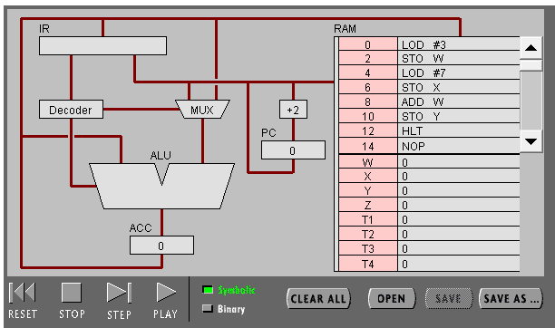
运行第一步，读入数字3
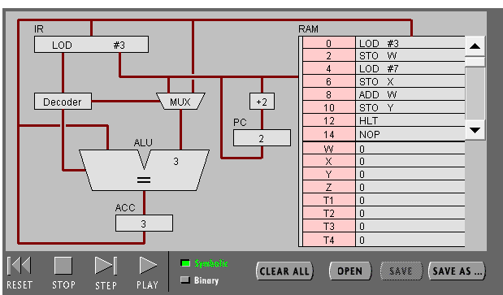
运行第二步，将3储存在W中
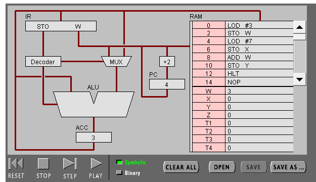
运行第三步，读入数字7
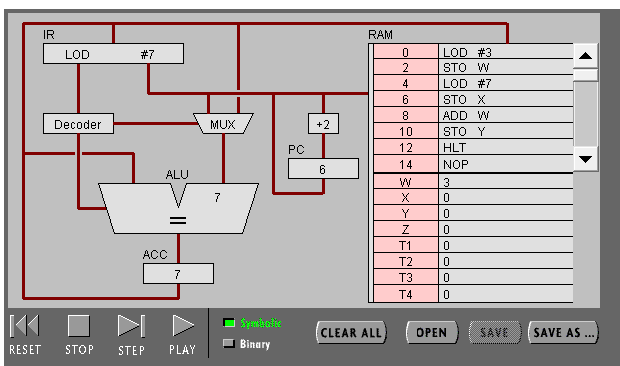
运行第四步，将数字7储存在X中
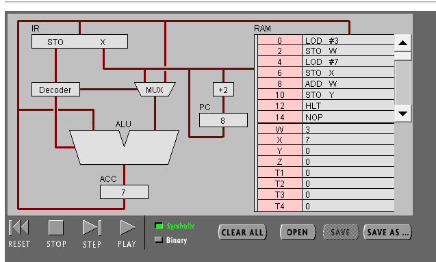
运行第五步，计算7+X（3）的值
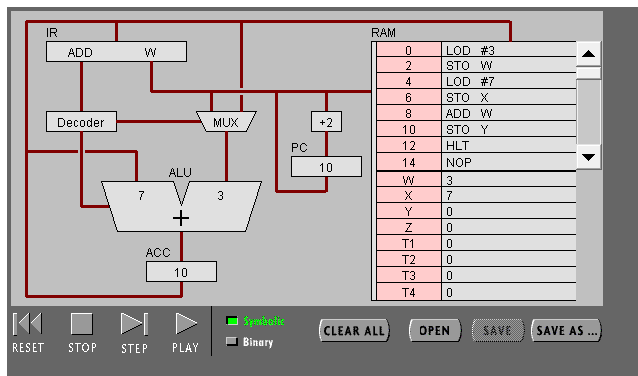
运行第六步，将结果存入Y中
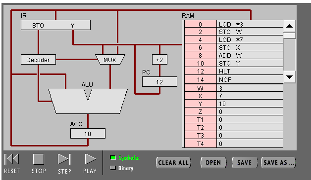
运行第七步，停止执行命令
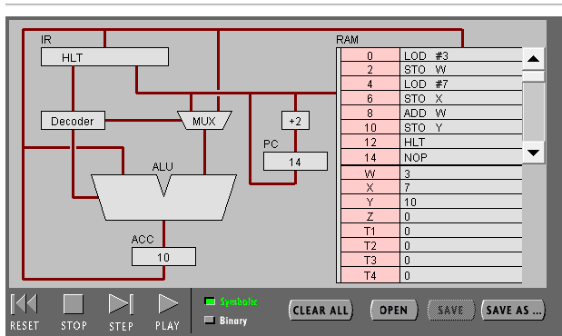
### question and answer
1. PC，IR 寄存器的作用。

PC的全称是program counter,就是用来计数来从内存中读取命令的，每执行完一条语句，PC都会加2.

指令寄存器是用来存放指令的，存放当前正在执行的指令，包括指令的操作数，地址数。

2. ACC 寄存器的全称与作用。

Accumulator
作用：存放操作数或运算结果。

3. 用“LOD #3”指令的执行过程，解释Fetch-Execute周期。
内存中获取指令，将指令寄存在IR寄存器，Decoder对指令进行解码，将LOD传给ALU，MUX将操作数传入ALU，ALU运算得到结果寄存ACC中,最后PC+2,准备读入下一条指令。
4. 用“ADD W” 指令的执行过程，解释Fetch-Execute周期。
内存中获取指令，将指令寄存在IR寄存器，Decoder对指令进行解码，MUX将W中的和ACC中的值传入ALU，ALU执行ADD操作将两数相加，并将结果存入ACC中。最后PC+2,准备读入下一条指令。
5. “LOD #3” 与 “ADD W” 指令的执行在Fetch-Execute周期级别，有什么不同。

LOD #3只需访问RAM一次,而ADD W需要两次访问RAM 
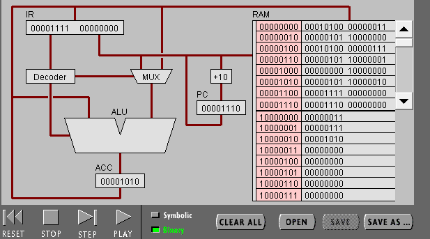

点击“Binary”,观察回答下面问题
1. 写出指令 “LOD #7” 的二进制形式，按指令结构，解释每部分的含义。
00010100 00000111 
前一个为命令指示，后一个为操作数 
2. 解释 RAM 的地址。
RAM只用于暂时存放命令和数据，一旦断电将全部消失。
3. 该机器CPU是几位的？（按累加器的位数）
16位
4. 写出该程序对应的 C语言表达。
    ```
    # include<stdio.h>
    int main(){
    int W=3;
    int X=7;
    int Y=W+X;
    }
## Part 2
(1) 输入程序Program 2，运行并回答问题：

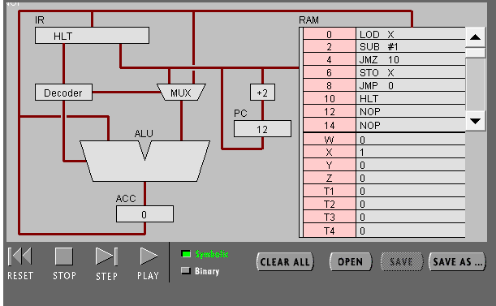

用一句话总结程序的功能

将数字3一直减1直到0.

写出对应的 c 语言程序

    
    #include <stdio.h>
    int main()
    {
        int X=3;
        while(X!=0)
        X--;
    }

（2） 修改该程序，用机器语言实现 10+9+8+..1 ，输出结果存放于内存 Y

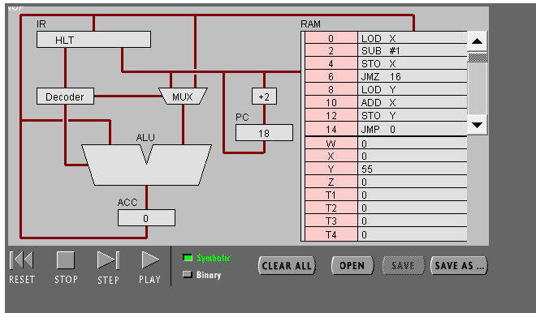

写出 c 语言的计算过程

    #include<stdio.h>
    int main()
    {
        int X=11;
        int Y=0;
        while(X!=0)
        {
            X--;
            Y=Y+X;
        }
    }

写出机器语言的计算过程

00000100 10000001

00010001 00000001

00000101 10000001

00001101 00010000

00000100 10000010

00000000 10000001

00000101 10000010

00001100 00000000

00001111 00000000

用自己的语言，简单总结高级语言与机器语言的区别与联系。

* 区别：高级语言相对于机器语言更容易阅读，更容易编写，更有利于开发软件。

* 联系：高级语言也要通过编译器转化为机器语言然后再进行运行。