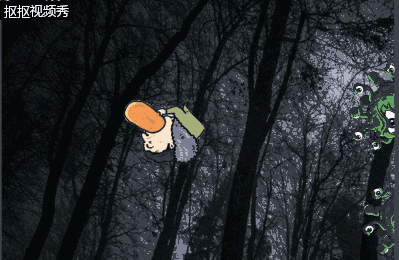

# 
## 游戏策划
楔子(Setting)：吃着热狗的WSC走进了一篇黑色森林，里面有许多绿色的毛茸茸的多眼怪兽。WSC为了保命用热狗🌭对怪兽进行喂食。。。

玩法(Gameplay)：玩家对怪物射击喂食热狗，每三个热狗可以喂饱一只怪兽，可以避免被怪兽吃掉。如果怪兽碰到玩家，则游戏结束。

人设与道具（Game Sprites）：

1. Player：WSC 可三百六十度旋转，跑的速度与怪兽相当，不会被怪兽追上。嘴上吃着热狗，准备用热狗喂食怪兽

2. monster：怪兽，很饿想吃东西，需要吃三个热狗或一个玩家才可吃饱。
3. hotdog：热狗，可以从Player嘴中发射出来，可用于喂食怪物。
4. score：每喂饱一个怪兽加100分，按分数大小进行比较排名。

## 游戏设计

    1. Object:hotdog
    Attribute:图片,位置
    Collaborator：WSC，monster 
    Events & Actions：碰撞 & 销毁自己
     2. Object:WSC
    Attribute:图片,位置，动作，移动
    Collaborator：热狗，monster 
    Events & Actions：360度旋转&&移动&&发射热狗&&接触怪兽死亡
     3. Object:monster
    Attribute:图片,位置，移动（速度方向）
    Collaborator：WSC，热狗
    Events & Actions：自由移动&&自动生成&&接触三个热狗销毁&&碰到WSC令其销毁
     4. Object:background
    Attribute:图片
    Collaborator：无
    Events & Actions：无
    5. Object:explosion
    Attribute:图片
    Collaborator：hotdog， monster
    Events & Actions：透明淡化效果&&hotdog碰撞monster时显示，其后消失
    6. Object:game overtext
    Attribute:文本
    Collaborator：WSC，monster
    Events & Actions：开始隐藏&&WSC碰上monster时出现
    7. Object:score
    Attribute:文本
    Collaborator：monster
    Events & Actions：monster消失时数值增加

 ## 效果展示
 

 （ps：由于水印遮挡导致分数无法正常显示！！）