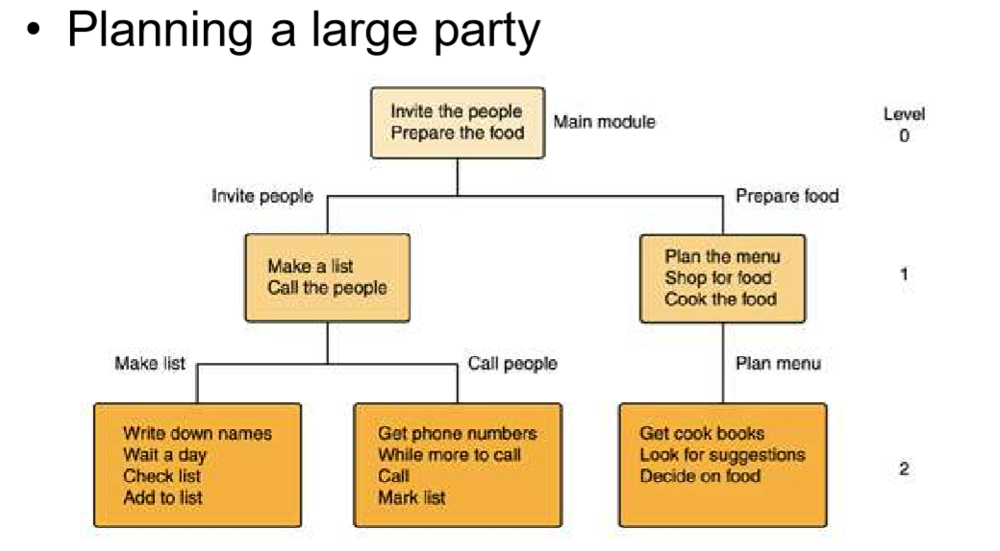

# 自顶向下，逐步求精——洗衣机程序的奥秘
## 思想介绍
自顶向下设计 ：一种逐步求精的设计程序的过程和方法。对要完成的任务进行分解，先对最高层次中的问题进行定义、设计、编程和测试，而将其中未解决的问题作为一个子任务放到下一层次中去解决。这样逐层、逐个地进行定义、设计、编程和测试，直到所有层次上的问题均由实用程序来解决，就能设计出具有层次结构的程序。
   ——百度百科
  
  In computer science, divide and conquer is an algorithm design paradigm based on multi-branched recursion. A divide and conquer algorithm works by recursively breaking down a problem into two or more sub-problems of the same or related type, until these become simple enough to be solved directly. The solutions to the sub-problems are then combined to give a solution to the original problem.
   ——Wikipedia
## 个人理解
所谓“自顶向下，逐步求精”，一定是在一个大问题的基础之上，将这个大问题分解为若干小问题，再将这些小问题再进行划分，直到变成一个个简单易行的小问题。这样，会让我们做事更有层次感，更加有条理。

利用这个原理，我们在编写程序时也可以将任务进行分解，写成一步又一步小命令，最后再将这些小命令连接起来。这样我们的程序也就完成了。

下面我想用洗衣机洗衣服这个程序来简单介绍一下“自顶向下，逐步求精”的思想。

但首先我们先来看一个小例子——关于举行一次party的设计思想。
 
通过这个案例我们可以看到，举行一场派对所需要的任务无非就是邀请和准备，然后我们再将这两个任务再细分，最后我们的任务就变成了具体的实施步骤。
## 洗衣机案例

 若使用之前所述的“自顶向下，逐步求精”的方法，首先要做的，便是分析洗衣机所具有的功能，然后是这些功能操作所需要的过程，然后我们在分别对此以程序！ 

正常而言，一个洗衣机程序，有进水，浸泡，洗涤，排水，脱水等程序。 

而将它们分别用代码实现，则又需要思考设计它们分别的实现方式，比如说，脱水时间、进水的时间或量、以及洗涤时洗衣机滚轴的转动方式等等。而思考到这一层之后，接下来进行的便是使用最简单使实用的代码使之实现！！
首先我们先给出基本代码：

        water_in_switch(open_close)  // open 打开上水开关，close关闭

        water_out_switch(open_close)  // open 打开排水开关，close关闭 
 
        get_water_volume()  //返回洗衣机内部水的高度

        motor_run(direction) // 电机转动。left左转，right右转，stop停

         time_counter()  // 返回当前时间计数，以秒为单位 halt
 
        (returncode) //停机，success 成功 failure 失败

然后，我们根据基本代码先写出我们的实现方式：
1. 选择洗衣模式——对应水位，浸泡时间，洗涤时间,脱水时间

2. 注水——水位计计水位 

3. 浸泡——计时器计时 

4. 电机转动——左3次，右3次 

5. 排水—— 水位计计水位 

6. 电机转动——脱水

7. 结束

现在，我们写出伪代码：

    1.  READ 洗衣模式；
    2. water_in_switch(open)；
        IF get_water_volume() >= 对应水位 THEN
        water_in_switch(close)
        ENDIF
    3. REPEAT 浸泡 UNTIL time_counter()==浸泡时间 
    4. IF time_counter()<洗涤时间 THEN
        motor_run(left) three times
        motor_run(right)three times
        ENDIF
    5。water_out_switch（open）
        IF  get_water_volume() ==0 THEN
        water_out_switch(close)
        ENDIF
    6.  REPEAT
        motor_run(left) 
        UNTIL
        time_counter()==脱水时间
    7.returncode

通过改动程序中的一些参数，我们便可以实现对洗衣机不同洗衣模式的控制。如水量增多，加强漂洗时间，加长甩干时间，等等。

以上就是洗衣机程序以伪代码方式展出，通过“自顶向下，逐步求精”的思想，让我们分析程序更加简单，思路更加清晰。

## 小结
“自顶向下，逐步求精”可以说是程序设计中的指导思想，通过这种思想，可以让大问题转换成小问题，通过解决一个个小问题来解决大问题。我们要尽快掌握这种思想，让程序设计更加简单粗暴！