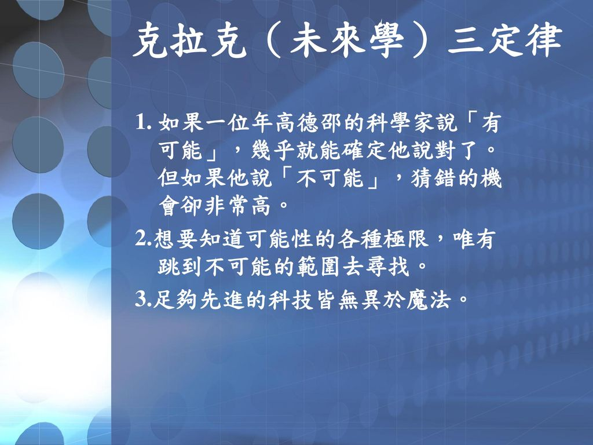
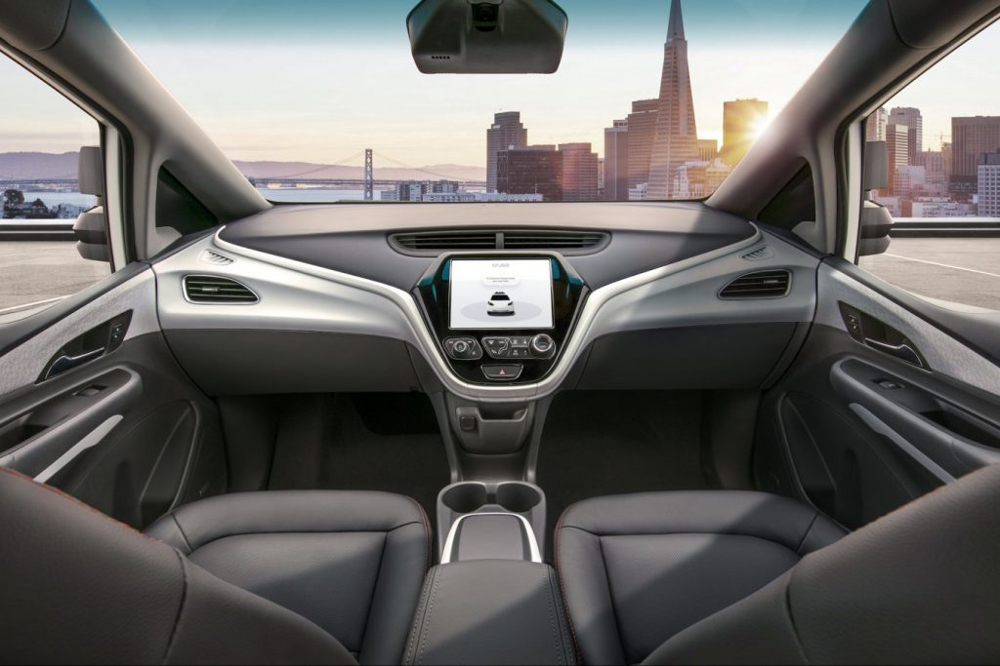
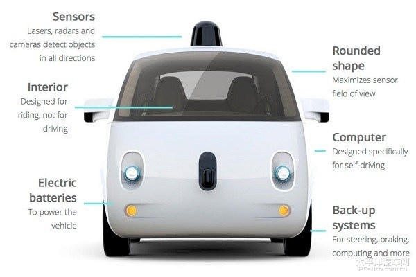
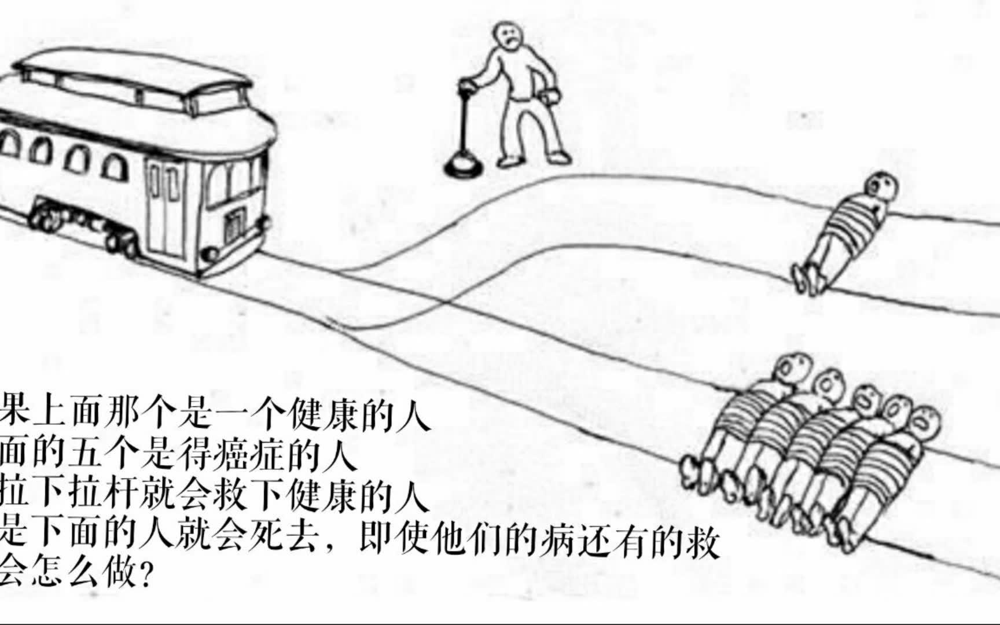
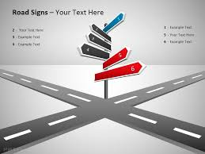

# 自动驾驶引发的伦理问题

20世纪最有影响力的科幻小说家、经典巨著《2001太空漫游》的作者亚瑟克拉克爵士提出过一个很有意思的“克拉克三定律”，其中第三条就是：任何非常先进的技术，初看都与魔法无异。

自动驾驶车也是如此，在它还未出市场前就有人将其奉为神物。人们对它的功效寄予厚望：希望可以解放双手，让驾驶成为乐趣；解决高速或城市环线的交通拥堵；降低交通事故发生率；甚至可以提升汽车燃油经济性。

无论是互联网企业还是传统汽车企业，自动驾驶领域路试都在如火如荼进行中。沃尔沃自动驾驶计划于2017年在哥德堡的公路上进行测试。甚至称其目标是在2020年前消除车祸中的死亡事故。即将到来的北京车展上，北汽也将推出旗下首款高智能化产品并现场演示无人驾驶功能。

但一直致力于无人驾驶汽车研发的谷歌最近却陷入“撞车门”。安全行驶220多万公里后，其纪录于2月14日被终结。谷歌无人驾驶汽车在加州撞上一辆公交车，当时是为了躲避路边下水道入口处的沙袋，先停下、再启动，偏向了内侧车道。这是首次由无人驾驶汽车引发的事故。

由于无人驾驶汽车过于遵守交通规则，在混乱、堵塞等路况出现时，很容易和不那么专心的人类司机撞车。谷歌的撞车事件也再次引发了对自动驾驶汽车的思考，即在实现了无人驾驶车的技术发展背后潜藏的一大串的伦理道德和法律问题。自动驾驶时代正在飞奔而来的当下，需要我们快速填补这些空白。

绕不过的“电车难题”

电车难题最早是由哲学家Philippa Foot提出的，用来批判伦理哲学中的主要理论，特别是功利主义，它的内容是这样的：
五个无辜的人被绑在电车轨道上。一辆失控的电车朝他们驶来，并且片刻后就要碾压到他们。幸运的是，你可以拉一个拉杆，让电车开到另一条轨道上。但是在那另一条轨道上也绑了一个人。你有两个选择：1. 不拉杆，五人死于你手下。2. 拉杆，一人死亡。你会怎么做呢？

此处，如果将电车化为一辆自动驾驶汽车呢？由于大部分道德决策都是根据“为最多的人提供最大的利益”的原则作出的，那这辆自动驾驶汽车毫无疑问会选择放弃一个人而拯救五个人。但如果这单独的一个人是我们的至亲、挚友呢？

如果未来的有人驾驶完全被无人驾驶取代，那我们就必须接受这种刻板的社会道德准则。让你眼睁睁地看着与你有直接关系的人的生死掌握在自动驾驶汽车的手中，你愿意接受吗？

避不开的“合法化”问题

现在关于自动驾驶汽车的争议，除了伦理道德，就是在自动驾驶的推进过程中，法律是其面临的最大阻力。这些自动驾驶汽车一旦发生交通事故，谁才是责任承担者？我们先看看各国如何应对。

美国：

现在只有内华达州、加州和佛罗里达州相继通过了法律条规，允许自动驾驶车辆上路测试。不过，该法规有附加条款，比如车内必须有人持有驾照，懂得操控汽车，在紧急情况下必须接过汽车的控制权。

欧盟：

目前，总部位于布鲁塞尔的欧盟总部也在就如何修改现行有关驾驶的法律法规（ECE R79）从而支持自动驾驶的健康快速发展，展开讨论和研究工作。

日本：

日本也提出要在2020年之前实现自动驾驶汽车方面的立法，并将自动驾驶作为今年9月七国集团交通部长会议的议题，预计会在今年内汇总出法规草案。

中国：

2016年两会上中国也有了新动态：

2016年两会期间，全国政协委员、吉利集团董事长李书福在今年两会上也呼吁加快自动驾驶立法。李书福建议，

第一，相关部门应该研究分析我国现行的法律法规，识别并着手修改阻碍自动驾驶发展的相关条款。

第二，政府要引导汽车厂家或零部件供应商以及大学科研机构重视用户体验，开发出来的自动驾驶技术一定要能够提供更好的用户体验，从而为自动驾驶的推广奠定良好的用户基础。

第三，在自动驾驶立法过程中，还要综合考虑如何制定相关的产业政策，包括技术路线、行业标准、安全规范、交通执法、保险责任等各个层面。

此前，李书福也曾表示，“汽车工业正在进入智能时代，迈进了汽车与互联网融合的新阶段。车联网、人工智能和自动驾驶是智能互联汽车的三大技术，而自动驾驶更是三者融合的方向。”

在汽车领域，已有众多企业将自动驾驶的时间节点锁定在2020年前后。在这个十字路口上，政策法规应该成为自动驾驶的风向标。

