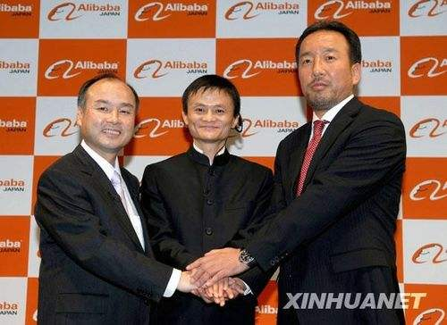
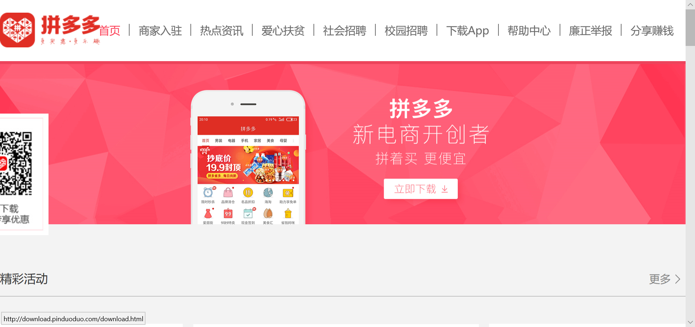
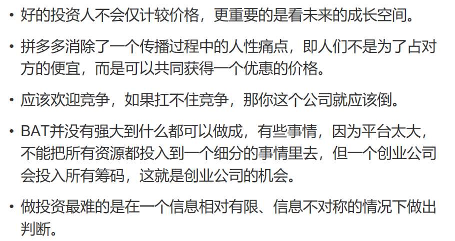

# 浅谈风险投资与IT行业

## 什么是风险投资

风险投资（英语：Venture Capital，缩写为VC）简称风投，又译称为创业投资，是一种私募股权，一种融资形式，由公司或基金提供给被认为具有高增长潜力或已经表现出高增长的小型早期新兴公司（员工数量，年收入或两者兼而有之）。典型的风险资本投资发生在最初的“种子资金”轮次之后。第一轮为增长提供资金的机构风险资本被称为A轮融资。风险资本家提供此融资是为了通过最终的“退出”事件产生回报，例如公司首次在首次公开募股（IPO）中向公众出售股票或进行并购（也称为作为公司的“贸易销售”）。风险投资公司或基金投资于这些早期阶段的公司，以换取他们投资的公司的股权或所有权股份。风险投资家承担风险，为有风险的初创公司提供融资，希望他们有些公司能够支持将成功。（引用wiki）

## 世界著名风险投资企业

美国的红杉资本（Sequoia Capital）可能是最著名的风险投资公司之一。2005年9月，德丰杰全球基金原董事张帆和携程网原总裁兼CFO沈南鹏与Sequoia Capital (红杉资本)一起始创了红杉资本在中国的事业(Sequoia Capital China)。张帆曾是百度、空中网和分众传媒的投资者，沈南鹏则是携程、如家的联合创始人。张帆于2009年因个人原因离开红杉资本中国，并于2018年在美国创建Axone Ventures投资量子计算机等高科技领域。

日本的软银投资公司，在世界上也被认为是成功的风险投资企业，该公司因为从投资美国的雅虎网站中获利颇丰。值得一提的是，该公司在中国投资就是并购了好耶网络广告的分众传媒。软银对于分众的投资是早期投资。 **阿里巴巴的马云曾在1995年得到软银孙正义的风险投资**。

## IT行业的风险投资案例分析———拼多多
### 分析

拼多多作为近年来发展起来的IT业中的电商网站，实力不容小觑。

据报道，拼多多已经在近期完成一轮金额 30 亿美元左右的融资，腾讯领投，红杉资本也参与了这轮融资，这笔融资将使拼多多估值达到近 150 亿美元。不过还有一位熟悉这次交易的投资人士称，这次交易金额可能不到 30 亿美元。

拼多多成立于 2015 年，采用拼团的形式，以更低的价格购买商品。通过这样的模式，拼多多迅速成为中国发展最快的电商独角兽之一，并在 2016 年宣布与社交电商平台 “拼好货”合并，目前拼多多的手机应用已经累积了大约 3 亿用户。

阿里巴巴在不久前推出的 特价版淘宝也被外界认为直指低价团购电商平台拼多多。根据极光大数据发布的《2017 年度网络购物 app 市场研究报告》，在 2017 年最后一周，拼多多的渗透率从年初的 1.4% 增长到 19.4%，成为最大黑马。

腾讯领投拼多多新一轮融资：金额达 30 亿美元，估值近 150 亿最先出现在动点科技。

### 张震谈拼多多

**黄峥对行业见解独到，15分钟就打动了我**

记者：你跟拼多多的黄峥相识很早，你提到看中作为创业者的黄峥不断进化的能力，这种进化力除了估值以外，还体现在哪些方面？

张震：他思考问题的深度。第一，很善于思考。第二，能够结识一批最优秀的企业家，包括丁磊、王卫、OPPO的段永平、淘宝的孙彤宇，这四位优秀的企业家也是拼多多最早的投资人。其实能有幸跟其中一个人做好朋友，就是很好的运气了。2006年，段永平第一次见巴菲特，就带了黄峥一起，那时候他还很年轻。有机会跟全球最优秀的企业家、投资家一起交流，可以少走很多弯路。有时候大道至简，一句话就通透了。

记者：作为曾在谷歌工作的精英创业者，黄峥想到去三四线城市挖掘机会，包括做拼多多，灵感来源于哪里？

张震：一个是他过去创业做电商的经历，第二是做游戏的经验，游戏实际上是在研究人性。为什么大家会口口相传拼多多，就是因为它消除了一个传播过程中的人性痛点，即人们不是为了占对方的便宜，而是可以共同获得一个优惠的价格。

记者：怎么看待拼多多面对的争议？

张震：每个创业公司都会面临很多问题和挑战。首先，我们应该尊重创业者，这些人也是最有创新和突破精神的。其次，拼多多只是一个初创公司，成立也就两年多时间，发展速度超出了大家的预期。所有的平台型电商，都会面临这样那样的问题，但挑战恰恰在于留给你解决问题的时间也很短。平台最重要的是建立规则、信用。我觉得，对于这些创业者应该有更多的包容。

## IT行业风投总结

## 小结
正是有了风险投资，才让那些先进的想法逐渐变成现实，才让那些缺少资金的小公司有了发展空间，为IT行业注入新的活力和强大的竞争力，从而促进IT行业的高速发展。