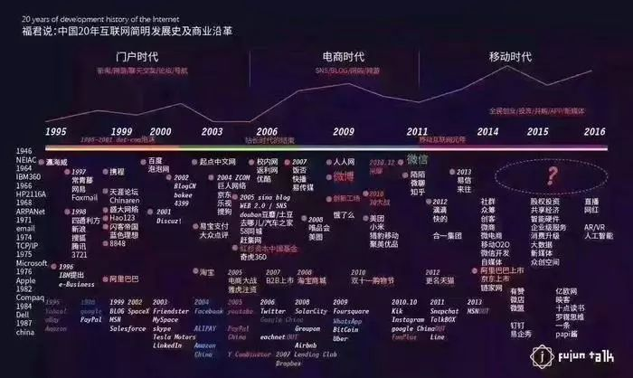

# 互联网时代的盈利模式————浅谈流量
如今在“大众创业、万众创新”双创大潮的推动下，成熟可行的商业模式成为了热门话题，尤其是互联网商业模式更是被越来越多的学者、创业者探讨和摸索。

1998年被称为中国互联网的元年，搜狐、新浪、网易、腾讯这四大门户网站几乎都在那一年成立，当时互联网刚进入中国，大家还不知道通过互联网怎么赚钱，彼时谁都没想到，20年后，这几位互联网的先行者能够凭几台电脑进入福布斯中国百富榜。（图为2018中国福布斯排行榜）

1999年，腾讯一周年的时候，因为没有盈利模式，账面上的钱烧完后，差点60万被卖掉，而如今，小马哥已经成为坐拥千亿的中国首富。

反观世界，进入福布斯排行榜的前十名也基本都为互联网行业。

盈利模式分为自发的盈利模式和自觉的盈利模式两种，早期的中国互联网并没有清晰的盈利模式，大家都在摸索尝试，很多靠卖广告勉强维持生计。

现如今，互联网的盈利模式越来越有规律可循，很多公司一开始就设计好产品清晰的盈利模式进入了自觉盈利，他们越来越有钱，财富积累的速度也越来越快。

**在互联网时代，流量就是金钱，有了流量，有了用户，就不愁赚不到钱。**

那么，互联网时代都有哪些具体的盈利模式呢？？

## 广告

广告是很多公司的第一收入模式。广告收入来源哪里？

流量！！

卖广告是早期中国互联网最原始的盈利模式，一直延续到了现在。在门户时代，四大门户网站就开始卖各种广告位，焦点图、通栏、弹窗等，经过20年的进化，广告形式越来越多样化，大数据让目标用户的定向也越来越精准。

卖广告的典型公司就是百度，话不多说，看图便知。

## 电商

世界上最早的电子商务公司是如今的世界首富Jeff Bezos在1995年创办的亚马逊。中国最早的电子商务公司则是马云在1999年创办的阿里巴巴

严格来说淘宝天猫的盈利模式不是卖货，他们只是给商家提供了一个卖货的平台，他们真正盈利的是商家交易抽成等广告业务。

所以说，电商最终的收入来源的大部分还是需要流量。

## 增值服务
基础功能免费，高级功能收费。先用免费的产品和服务去吸引用户，去抢占市场份额和用户规模，然后再通过增值服务或其他产品收费。

今年4月底，雷军在小米的发布会上说小米硬件的净利润率不超过5%，他可能没有撒谎，因为在小米的生态链条里，硬件免费+内容/服务收费，这是一个完整的生态闭环模型。

增值服务做的最好的当然就是马化腾。各种高级服务，只要你有钱，只有你想不到，没有你得不到。所以，有一句话“腾讯游戏，用钱创造快乐！”。

当然，增值服务的基础也是要有巨大的流量。能吸引到用户，能让用户甘愿花钱享受便捷的服务，这才是增值服务的精髓所在。

## 小结
任何一个成熟的产品生态里，都不会仅有一种盈利模式，它一定是多元的。盈利模式做为商业模式里的一环，是一个企业可持续发展的基础，但也需要不断的变革和创新。

当然这一切的基础都是要有广大的流量。在互联网的时代，流量是绝大多数盈利模式的基础。所以说流量大小，在很大程度上影响着这些互联网公司的收入多少。