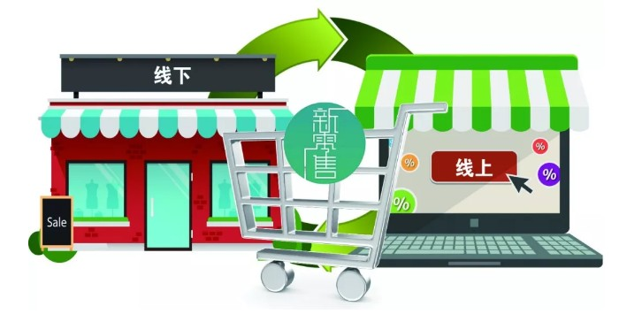
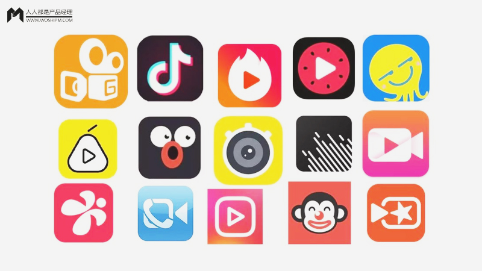
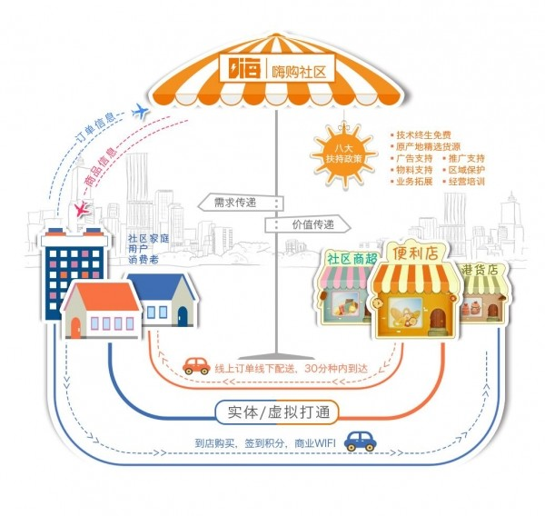

# 互联网时代的热点领域选择、营销方法
近年来，随着互联网行业的蓬勃发展，一些领域逐渐进入人们的视野，成为热点领域。下面我想介绍一些热点领域和其营销方法。
## 2019年最被看好的几个热点领域

1. AI人工智能，人工智能近两年很火，人工智能类产品将会越来越多。

2. 智慧新零售，目前线上电商越来越多的走到线下开店，2019年智慧新零售也将会是一种发展趋势。

3. 电竞行业，2018年末王思聪的IG夺冠让越来越多普通人开始关注电竞行业，未来的一年内电竞行业将会是互联网行业投资热点。

4. 视频社交电商化，不管是抖音还是快手、西瓜视频、火山小视频，未来一年内仍将持续火热，并将形成规模的商业社交模式。

5. 社区电商的兴起，现在逐渐兴起的小区社区电商模式2019年也将成为一个新的热点。

## 互联网时代的营销方法——以用户为中心

### 互联网时代的唯C论
早在1990年，美国营销学者罗伯特·劳特朋曾发文指出，传统的以生产者为中心的4P思维方式已经过时，营销者应该以消费者为中心，按照4C思维方式生产消费者所需要的产品，以他们所认可的价值定价，在他们方便的地方销售，与他们进行有效的沟通。4C指：顾客(Consumer)、成本(Cost)、方便(Convenience)、沟通(Communication)。互联网时代，这种4C思维将更加重要，也更加需要。

### 社交的强大
互联网时代，社交连接一切，企业和用户之间、用户和用户之间的沟通变得越来越便利，和用户做朋友，最大限度解决用户心中疑问，在用户面前尽可能多地展现企业或者产品信息，将会直接影响到企业的销售；对产品的感觉如何、满意与否，由于都可以在网上进行评价，而这些评价将会直接影响到品牌形象。

### 大数据支撑下的C时代
 C时代的到来是诸多因素共同造成的，而大数据无疑是其中一个重要的支撑。因为移动互联网的普及使人们的选择范围更加的广泛，传统的发放调查问卷的方式，人们往往没有多余的时间完成一份详尽的调查问卷，受采集样本有限和不均衡影响等先天缺陷影响，因此采用这一方式收集C端消费者行为等信息变得越来越不准确，难度也越来越大。那么大数据概念的提出和云计算的普及，为消费者数据收集和计算提供了更加强大的工具。挖掘C端消费者数据越是疯狂，则越是显示出C端消费者的重要性。

### 小结
 总的来说，互联网时代，做好以用户为中心，就找到了互联网时代的方法论。

（部分引用李光斗的文章，特此注明）

